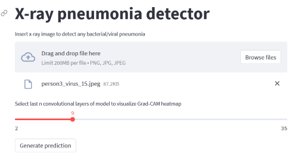
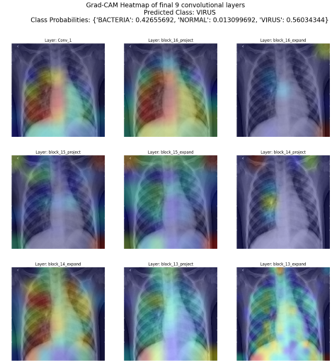

# Explainable-Neural-Networks for pneumonia detection Gradient-weighted Class Activation Mapping (Grad-CAM)


## Introduction

Bacterial and viral pathogens are the two leading causes of pneumonia but require very different forms of management. Bacterial pneumonia requires urgent referral for immediate antibiotic treatment, while viral pneumonia is treated with supportive care. Therefore, accurate and timely diagnosis is imperative. One key element of diagnosis is radiographic data, since chest X-rays are routinely obtained as standard of care and can help differentiate between different types of pneumonia

The objective of this project is to develop a transfer learning framework in classifying pediatric chest X-rays to detect pneumonia and furthermore to distinguish viral and bacterial pneumonia to facilitate rapid referrals for children needing urgent intervention.

To understand the classifications made by the deep learning model and enhance explainability of its black box nature, the visual explaination algorithm Gradient-weighted Class Activation Mapping (Grad-CAM) generates heatmaps that are superimposed on the test images to provide visual explainability on the model. The heatmap highlights the important regions in the X-ray image for predicting the classes.

The Grad-CAM technique utilizes the gradients of the classification score with respect to the final convolutional feature map, to identify the parts of an input image that most impact the classification score. The places where this gradient is large are exactly the places where the final score depends most on the data. 
## Data

```bash
├── data
│   ├── test
│   │   ├── BACTERIA
│   │   └── NORMAL
│   │   └── VIRUS
│   ├── train
│   │   ├── BACTERIA
│   │   ├── NORMAL
│   │   └── VIRUS
```

**Percentage of classes in train and test set**

|         dataset|   train|    test|
|----------------|--------|--------|
| pct_of_bacteria|  48.581|  38.782|
|   pct_of_normal|  25.709|  37.500|
|    pct_of_virus|  25.709|  23.718|

**Number of classes in train and test set**

|            dataset|  train|  test|
|-------------------|-------|------|
| number_of_bacteria|   2534|   242|
|   number_of_normal|   1341|   234|
|    number_of_virus|   1341|   148|

There are a total of 5216 and 624 images in the train and test set respectively. The train set is further split to obtain a validation set for model training. Below are sample images for each of the classes:


The normal chest X-ray (middle panel) depicts clear lungs without any areas of abnormal opacification in the image. Bacterial pneumonia (left) typically exhibits a focal lobar consolidation, whereas viral pneumonia (right) manifests with a more diffuse ‘‘interstitial’’ pattern in both lungs.

## Model

A transfer learining framework is used to construct the model. The model utilizes the pre-trained weights from MobileNetV2 as a starting point. 
The layers in the base model is frozen to be used as a feature extractor.

The architecture of the model consists of:
- Input layer
- RandomFlip and Random Rotation layers for data augmentation (Note: Data augmentation is inactive at test time)
- Rescaling layer for standardization
- MobileNetV2 layers previously trained on the 'imagenet' dataset. (Layers are frozen for transfer learning)
- Global max pooling layer
- Dropout layer
- Number of dense layers with ReLu activation function
- Output layer of 3 classes with softmax activation


## Evaluation of baseline model


**Baseline model training parameters**
|                |                         |
|----------------|-------------------------|
|Batch size      |100                      |
|Dropout         |0.2                      |
|Loss function   |categorical crossentropy |
|Epochs          |50                       |
|Optimizer       |adam                     |
|Learning rate   |0.001                    |


**Confusion Matrix of test data**

.png)

**Test data metrics for each class**


| Metric     | BACTERIA   | NORMAL     | VIRUS      | OVERALL    |
|------------|------------|------------|------------|------------|
| Accuracy   | 86.4%      | 88.5%      | 86.1%      | 80.4%      |
| Precision  | 77.5%      | 86.8%      | 75.6%      | 80.6%      |
| Recall     | 91.3%      | 81.6%      | 60.8%      | 80.4%      |


### **What the model did well**

The model was able to classify most of the "BACTERIA" images correctly, achieving a recall of 91.3%.

The model is very precise in its classification of "NORMAL" images. For the images that were correctly predicted to be the "NORMAL" class, the final convolution layer of the model mostly focused on parts of the X-ray that weren't on the lungs, instead primarily focusing on the mid-center section where the neck is located at.

.png)


### **What the model didn't do well**

The model incorrectly classified alot of "VIRUS" images as "BACTERIA", indicating that it was unable to differentiate "VIRUS" images from "BACTERIA" images. The section that the model's final convolutional layer focused on was inconsistent and random, being unable to focus on the diffuse interstitial pattern found in both lungs

.png)


## Evaluation of fine-tuned model

The baseline model was then fine-tuned by unfreezing the top layers of the MobileNetV2 base model (from layer 145 onwards), and reducing the learning rate by 100 times to not destroy the weights that was trained in the baseline model.


**Fine-tuned model training parameters**
|                |                         |
|----------------|-------------------------|
|Batch size      |300                      |
|Dropout         |0.2                      |
|Loss function   |categorical crossentropy |
|Epochs          |10                       |
|Optimizer       |adam                     |
|Learning rate   |0.00001                  |
|From layer      |145                      |


**Confusion Matrix of test data**

.png)

**Test data metrics for each class**


| Metric     | BACTERIA   | NORMAL     | VIRUS      | OVERALL    |
|------------|------------|------------|------------|------------|
| Accuracy   | 87.8%      | 89.9%      | 88.3%      | 83.0%      |
| Precision  | 81.9%      | 85.8%      | 80.0%      | 82.9%      |
| Recall     | 88.0%      | 87.6%      | 67.6%      | 83.0%      |

### **What the model improved on**

The fine tuned model improved slightly in its ability to differentiate "VIRUS" images from "BACTERIA" images. 

| Metric     | Baseline   | Fine-tuned |
|------------|------------|------------|
| Accuracy   | 86.1%      | 88.3%      |
| Precision  | 75.6%      | 80.0%      |
| Recall     | 60.8%      | 67.6%      |

For true positves of the "VIRUS" class, the model's final convolutional layer was more consistent in focusing on the interstitial pattern in the lungs 

.png)


## Deployment of model on Streamlit


The fine-tuned model is deployed on streamlit for inference. In addition to predicting the class that the X-ray image falls under, Grad-CAM heatmaps of the last n convolutional layers are also generated to visualize which part of the X-ray image is the model focusing on to make the prediction.








## Conclusion


By utilizing a transfer learning framework for feature extraction, the baseline deep learning model was mostly able to correctly classify lung X-ray images as "BACTERIA" and "NORMAL". However, the model was unable to differentiate "VIRUS" images from "BACTERIA" images, resulting in alot of "VIRUS" images incorrectly classified as "BACTERIA".

Upon further fine-tuning the top layers of the base model, the model has slightly improved in its ability to classify lung X-ray images as "VIRUS", resulting in better differentiation between the classes.

To observe a much better performance in classifying X-ray images as "VIRUS", more "VIRUS" labelled images can be collected for training.

The incorporation of the Grad-CAM algorithm in the evaluation of the predictions has provided much needed explainability as to which parts of the X-ray image impacts the classification score the most. Model explainability complementing with medical domain knowledge is cruicial in ensuring that an accurate diagnosis is performed on each X-ray image and differentiate between different types of pneumonia. 

Model explainability is also essential in performing error analysis. It enables drilling down on false outcomes of a specific class (eg False Negatives for "VIRUS") to visualize what is the model focusing on that is causing these false outcomes (eg. focusing on the arms instead of the lungs, unclear interstitial patterns in lungs). 


