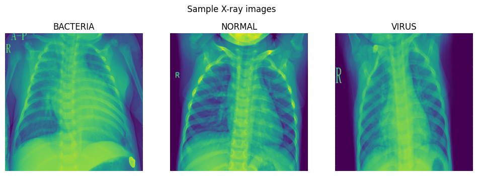

# Explainable-Neural-Networks for pneumonia detection Gradient-weighted Class Activation Mapping (Grad-CAM)


## Introduction

Bacterial and viral pathogens are the two leading causes of pneumonia but require very different forms of management. Bacterial pneumonia requires urgent referral for immediate antibiotic treatment, while viral pneumonia is treated with supportive care. Therefore, accurate and timely diagnosis is imperative. One key element of diagnosis is radiographic data, since chest X-rays are routinely obtained as standard of care and can help differentiate between different types of pneumonia

The objective of this project is to develop a transfer learning framework in classifying pediatric chest X-rays to detect pneumonia and furthermore to distinguish viral and bacterial pneumonia to facilitate rapid referrals for children needing urgent intervention.

To understand the classifications made by the deep learning model and enhance explainability of its black box nature, the visual explaination algorithm Gradient-weighted Class Activation Mapping (Grad-CAM) generates heatmaps that are superimposed on the test images to provide visual explainability on the model. The heatmap highlights the important regions in the X-ray image for predicting the classes.
## Data

```bash
├── data
│   ├── test
│   │   ├── BACTERIA
│   │   └── NORMAL
│   │   └── VIRUS
│   ├── train
│   │   ├── BACTERIA
│   │   ├── NORMAL
│   │   └── VIRUS
```

**Percentage of classes in train and test set**

|         dataset|   train|    test|
|----------------|--------|--------|
| pct_of_bacteria|  48.581|  38.782|
|   pct_of_normal|  25.709|  37.500|
|    pct_of_virus|  25.709|  23.718|

**Number of classes in train and test set**

|            dataset|  train|  test|
|-------------------|-------|------|
| number_of_bacteria|   2534|   242|
|   number_of_normal|   1341|   234|
|    number_of_virus|   1341|   148|

There are a total of 5216 and 624 images in the train and test set respectively. The train set is further split to obtain a validation set for model training. Below are sample images for each of the classes:



The normal chest X-ray (middle panel) depicts clear lungs without any areas of abnormal opacification in the image. Bacterial pneumonia (left) typically exhibits a focal lobar consolidation, whereas viral pneumonia (right) manifests with a more diffuse ‘‘interstitial’’ pattern in both lungs.

## Model

Transfer learining is used to build the model. The model utilizes the pre-trained weights from MobileNetV2 as a starting point. 
The layers in the base model is frozen to be used as a feature extractor.

The architecture of the model consists of:
- Input layer
- RandomFlip and Random Rotation layers for data augmentation (Note: Data augmentation is inactive at test time)
- Rescaling layer for standardization
- MobileNetV2 layers previously trained on the 'imagenet' dataset. (Layers are frozen for transfer learning)
- Global max pooling layer
- Dropout layer
- Number of dense layers with ReLu activation function
- Output layer of 3 classes with softmax activation


## Evaluation of baseline model


**Baseline model training parameters**
|                |                         |
|----------------|-------------------------|
|Batch size      |100                      |
|Dropout         |0.2                      |
|Loss function   |categorical crossentropy |
|Epochs          |50                       |
|Optimizer       |adam                     |
|Learning rate   |0.001                    |


**Confusion Matrix of test data**

.png)

**Test data metrics for each class**


For chest X-rays presenting as bacteria versus non-bacteria, the model achieved an accuracy of 86.4%, precision of 77.5% and recall of 91.3%

For chest X-rays presenting as normal versus non-normal, the model achieved an accuracy of 88.5%, precision of 86.8% and recall of 81.6% 

For chest X-rays presenting as virus versus non-virus, the model achieved an accuracy of 86.1%, precision of 75.6% and recall of 60.8%

The model's overall accuracy, precision and recall on the test set is 80.4%, 80.6% and 80.4% respectively


### **What the model did well**

The model was able to classify most of the "BACTERIA" images correctly, achieving a recall of 91.3%.

The model is very precise in its classification of "NORMAL" images. For the images that were correctly predicted to be the "NORMAL" class, the final convolution layer of the model mostly focused on parts of the X-ray that weren't on the lungs, instead primarily focusing on the mid-center section where the neck is located at.

.png)


### **What the model didn't do well**

The model incorrectly classified alot of "VIRUS" images as "BACTERIA", indicating that it was unable to differentiate "VIRUS" images from "BACTERIA" images. The section that the model's final convolutional layer focused on was inconsistent and random, being unable to focus on the diffuse interstitial pattern found in both lungs

.png)


